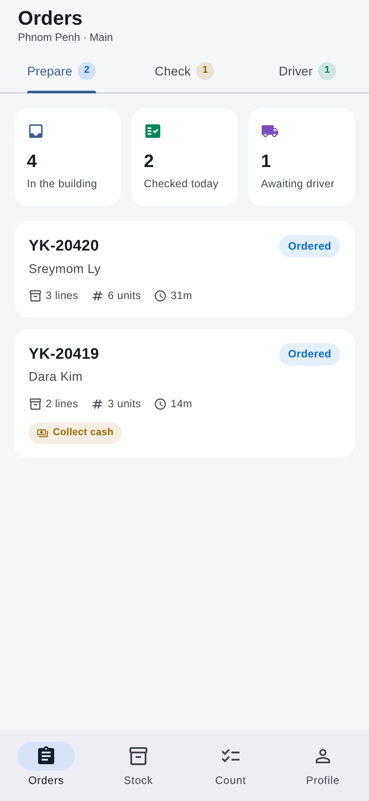
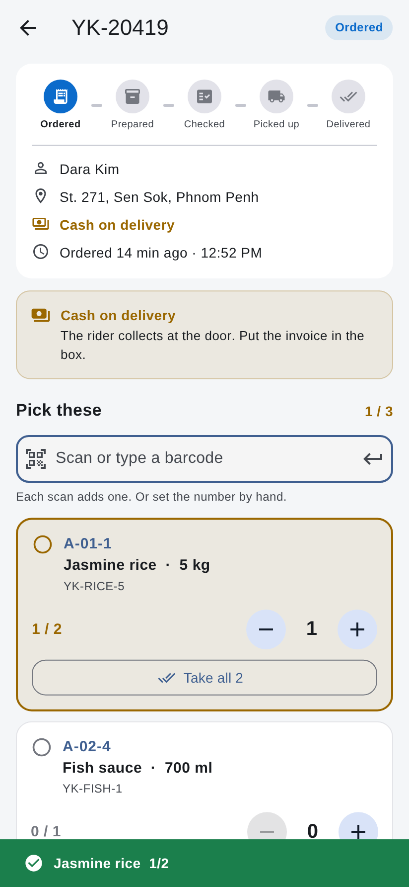
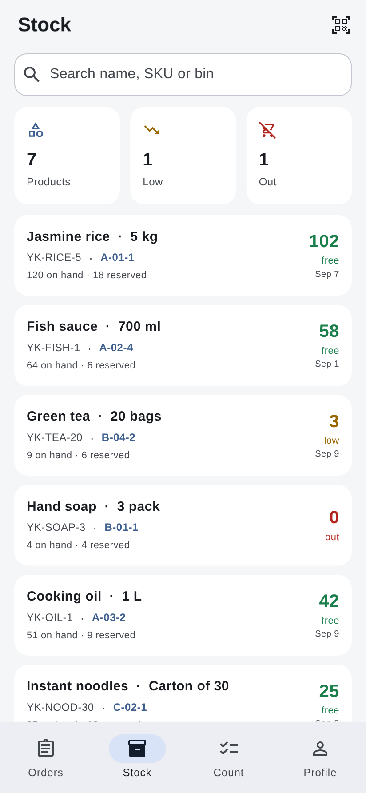

# Warehouse

A Flutter app for warehouse staff: move orders through the shop's fulfilment
stages, and scan or count stock. The floor-side companion to the
[`delivery_boy`](../delivery_boy) rider app.

| Queues | Preparing an order | Stock |
|---|---|---|
|  |  |  |

## Where it sits

The mekhea backend already defines the shop's five fulfilment stages, in
`core/api/shop/orders.py::STAGES`. The customer app filters its order list by
them and draws its timeline from them. This app owns the middle two:

```
ordered  →  prepared  →  checked  │  picked_up  →  delivered
└────── this app (warehouse) ─────┘  └── delivery_boy (rider) ──┘
```

The handoff is `checked` → `picked_up`. Staff pack an order and sign it off;
the rider marks it collected from their own app. Staff deliberately *cannot*
set `picked_up` — that is how parcels end up recorded as collected while still
sitting on the rack.

## What it does

- **Sign in** with a staff code and a 4-digit PIN. Handsets are shared, so
  signing out is one tap.
- **Three queues**, one tab each — Prepare, Check, Driver — worked oldest
  first, because a queue is worked front to back.
- **Pick an order** by scanning each item, or by setting quantities by hand.
  Each scan adds one unit and flashes the line it landed on.
- **A wrong scan says so**: a code that is not on this order is reported, not
  silently ignored.
- **Short picks need a reason.** An order that is short of what was ordered
  cannot move on until someone writes down why. Short picks are normal; short
  picks nobody mentioned are how the customer finds out instead of the shop.
- **Two-stage sign-off.** A packer prepares; a checker or supervisor confirms.
  A checker who finds a mistake sends it back to packing rather than cancelling
  it.
- **Stock**: search by name, SKU, bin or barcode; scan straight to a product;
  adjust with a reason (damaged, returned, received, correction, count).
- **Stock counts**: open one, walk the shelves, scan or type what you find,
  submit. Nothing on the shelf moves until you submit, and a count in progress
  is kept on the device — counting a warehouse rarely fits in one sitting.
- **Free-to-sell, not on-hand**, as the headline stock number. On-hand flatters;
  "we have 12" when 12 are already promised is how a shop oversells.
- **Dark mode**, following the system setting.
- **Survives a restart** — a part-picked order, a half-walked count and the
  signed-in session are all stored on the device.

## Running it

```bash
flutter pub get
flutter run
```

Seed data lives in `lib/data/mock_data.dart`, so every screen is explorable
with no backend. Any staff code and any 4-digit PIN signs you in.

```bash
flutter test      # 80 unit + widget + layout tests
flutter analyze   # clean
flutter build apk
```

## Scanning

The scan box is built for a **keyboard-wedge scanner** — the ring, sled or
gun-style Android terminal most warehouses actually run, which types the
barcode into whatever has focus and finishes with Enter. So the primitive is a
focused text field that submits on Enter and clears itself, and it works on day
one with no camera permission, no plugin and no platform channel. It doubles as
manual entry, because the label on a crushed box is sometimes the only readable
thing left.

Camera scanning is an addition rather than a rewrite: point a package like
`mobile_scanner` at `ScanField.onScan` and everything below it stays put.

## Connecting the backend

`WarehouseRepository` is the single seam. Replace the method bodies with HTTP
calls and nothing above it changes — the controllers and every screen stay as
they are. It is injected through `WarehouseApp(repository: ...)`, which is also
how the tests supply fixtures.

The endpoints it implies, using the same `Authorization: Bearer <token>` the
other Yeaksa apps already send:

| Method | Endpoint | Notes |
|---|---|---|
| `GET` | `/api/v2/warehouse/orders?stage=ordered` | reads; close cousin of the existing customer-side list |
| `POST` | `/api/v2/warehouse/orders/{id}/stage` | `{"stage": "prepared"}` — **new** |
| `POST` | `/api/v2/warehouse/orders/{id}/lines/{lineId}` | `{"picked": 2}` — **new** |
| `GET` | `/api/v2/warehouse/stock?q=` | reads |
| `POST` | `/api/v2/warehouse/stock/{id}/adjust` | `{"delta": -1, "reason": "damaged"}` — **new** |
| `POST` | `/api/v2/warehouse/counts` | submit a count — **new** |

The reads have close cousins already. The **writes are the work on the Django
side** — the storefront never had to move an order forward, so nothing exists
yet that lets staff set a stage.

Two notes for whoever writes them:

- **Adjustments are a delta, not an absolute.** Two people adjusting the same
  item from different handsets should both be applied; last-write-wins on an
  absolute silently drops one.
- **Stage timestamps should come from the server.** `preparedAt` and
  `checkedAt` are set client-side here, and the clock on a warehouse handset is
  not something to build an audit trail on.

## Layout

```
lib/
  main.dart              entry point
  app.dart               providers, theme, sign-in gate
  models/                FulfilmentStage, Order + OrderLine, StockItem,
                         StockCount + CountLine, Staff (+ JSON)
  data/                  WarehouseRepository (swap for real HTTP), LocalStore,
                         seed data
  state/                 SessionController, TasksController, StockController
  screens/               login, tasks, order detail, stock, stock detail,
                         count, profile
  widgets/               scan field, pick line, stock row, order card,
                         stage chip + timeline, qty stepper
  theme/                 light + dark palettes (AppColors ThemeExtension)
  utils/                 date / plural / signed-number formatting
```

State is plain `ChangeNotifier` + `provider`. Dependencies beyond the Flutter
SDK are `provider` and `shared_preferences` — the same two the rider app uses.

Card, page, per-stage and per-stock-level colours live in an `AppColors`
`ThemeExtension` with an explicit value for each brightness, reached via
`context.appColors`. Nothing paints a hardcoded colour, so both themes stay
deliberate.

## Rules worth knowing

- `FulfilmentStage.apiValue` is what goes on the wire — **never** `.name`.
  `pickedUp` and `picked_up` are deliberately not the same string, and a
  `.name` slipping into a request body filters nothing.
- The stage timeline is drawn from one list (`kStageTimeline`) rather than from
  hand-written tiles. The customer app once shipped six names indexed against
  four tiles, so `picked_up` lit the Delivered circle.
- A **packer** may prepare. Only a **checker** or **supervisor** may sign off a
  check, send an order back, adjust stock, or submit a count.
- An **uncounted** count line is not the same as a line counted as zero.
  Skipping a line leaves the shelf alone; counting zero writes it down to
  nothing.
- Expected quantities are frozen when a count opens, so a variance means the
  shelf disagreed with the book — not that an order shipped mid-aisle.

## Status

This is a working front-end. Orders, stock, the session and a count in progress
all persist on the device; the data itself is still seeded locally. Not yet
wired up: real authentication, the live order feed, camera scanning, printing a
picking slip or box label, and multi-warehouse switching.

The stages, the wire values and the role rules are all modelled against what
mekhea already does, so connecting it should be filling in
`WarehouseRepository` rather than reshaping the app.
